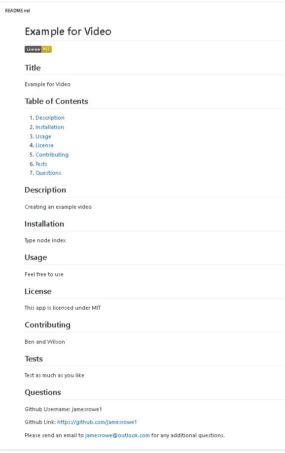

# READMEGenerator

## Project Title

READMEGenerator

## Project Link

https://github.com/jamesrowe1/READMEGenerator

## Screenshot

## Getting Started

Begin opening your terminal into the directory this application is stored in. Type "npm install" and then allow the packages to be installed. After they are installed, type "node index.js" and then proceed to answer the following prompts:

- Enter Project Title
- Enter Installation Instructions
- Enter Usage Information
- Enter Contributions
- Enter Test Instructions
- Choose License (you are given a choice of 4, choose the most appropriate one)
- Enter Github Username
- Enter Email Address

A README with the information you entered will be placed into the Output folder with called README.md.

## Prerequisites

You must have node installed in your terminal. Experience with node is suggested.

## Built With

- Visual Studio Code
- JavaScript
- Node
  -File system ("fs")
- NPM
  - inquirer
- Hosted by Github
- Video be Screecastify

## Authors

James Rowe

## License

Licensed under Awesome Coding L.L.C. (not a real company)

## Troubleshooting

For any issues contact James Rowe

## Acknowledgments

- Ben Wright
- Justin Simero
- Wilson Linares
